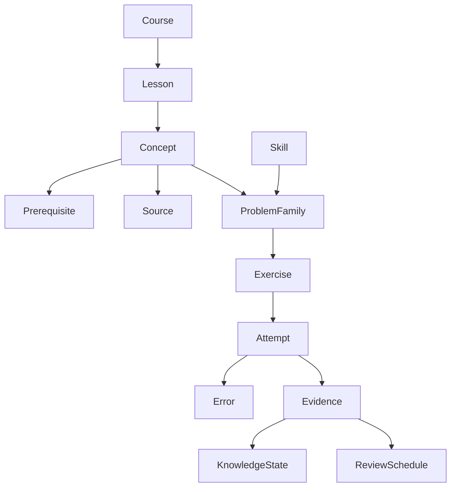

# Modelo académico V14

El catálogo pedagógico versionado es local en V14 (`dist/academic/model.js`); no se ha creado una base de contenido remoto. Los registros de usuario se guardan en caché/outbox y en tablas privadas PostgreSQL. Cambiar el texto de un concepto no cambia su ID ni borra evidencia; si cambia su significado, el autor debe crear ID/versión y una migración semántica explícita.

| Entidad | ID y responsabilidad |
| --- | --- |
| Course / Lesson | `organica` / `org-01`; contexto de los contenidos actuales. |
| Concept | ID estable como `org.resonance`, título, descripción, curso, lecciones, versión, tags y actividad. |
| Skill | Habilidad separada del tema: identificar, dibujar, comparar, justificar, predecir, calcular o transferir. |
| Prerequisite | Arista `from → to` con fuerza `required` o `recommended`. Un índice de adyacencia permite directos, ancestros y descendientes; se rechazan ciclos. |
| ProblemFamily | Patrón de razonamiento con conceptos, habilidades, dificultad, validador y versión; puede contener varios ejercicios. |
| Exercise | ID `org-01:b01` etc., familia, conceptos, habilidades, dificultad, tipo de respuesta, validador, transferencia y versión. Los b01–b11 y variante/transferencia existentes son el piloto. |
| Misconception | Patrón y feedback específico; solo se confirma con evidencia explícita de distractor/validador. El error de autorúbrica deja una candidatura, sin fingir lectura semántica del texto. |
| Attempt | ID único, ejercicio, familia, conceptos, habilidades, resultado, ayuda, confianza, fecha UTC, versión, diagnóstico y `activityType/activityId`. No guarda el texto completo de la respuesta en esta tabla. |
| Error | Referencia a intento y concepto/familia, misconception confirmada o candidata, fecha y estado pendiente/revisado/resuelto. |
| Evidence | Evento por intento y concepto, con éxito/fallo, ayuda, transferencia, recuperación diferida y origen `activityType/activityId` (lesson/review; futuros practice/game/exam/lab). Es inmutable e idempotente por ID. |
| KnowledgeState | Proyección derivada: `unseen → guided → independent → transferable → retained`. Los labels visibles se pueden cambiar. Un fallo aislado no borra logros; completar una lección no equivale a retención. |
| ReviewSchedule | Tarjeta por concepto/familia, vencimiento UTC, estado FSRS y último intento aplicado. La versión V14 crea tarjetas de concepto; las fechas legadas de clase siguen visibles sin multiplicarlas. |
| Source | Tipo book, ppt, guide, exam, answer_key, recording, transcript, lab_manual, web u other; título, URL HTTPS opcional, ubicación, autoridad `course_official/professor/recommended/supplementary/personal` y versión. Una relación concepto–fuente admite varias fuentes por concepto. |

## Flujo de org-01

El ejercicio existente b01 se mapea a `org.protonation.charge` y los conceptos protonación/par libre. Su autoevaluación estructurada genera un intento y evidencias con ID estable, actualiza estado derivado y programa una tarjeta FSRS. El texto redactado por el alumno permanece en el progreso local/cloud de la lección según la arquitectura anterior, pero **no se manda a PostHog ni se copia a la evidencia analítica**. La rúbrica personal no es una corrección automática verificada.

El diagnóstico requiere errores independientes en al menos dos familias distintas que compartan un prerequisito `required`. Devuelve `possible` con las familias que sustentan la sospecha. Dos intentos diagnósticos de familias distintas producen `confirmed` si ambos fallan, o `not_confirmed` en caso contrario. Un fallo aislado nunca declara un prerequisito débil. La UI ofrece una explicación y un control simple para registrar el diagnóstico; el Rescate completo es futuro.

El motor de conocimiento exige éxito sin ayuda para `independent`, éxito de transferencia sin ayuda para `transferable` y recuperación sin ayuda al menos 24 h después junto a transferencia para `retained`. FSRS 5.4.2 calcula la siguiente fecha y **no decide dominio**. Reintentar un mismo ID no duplica evidencia y puede reintentar una tarjeta que falló por indisponibilidad del módulo.

## Validadores y fuentes

`classifiers.js` ofrece MCQ con distractor etiquetado, numérico con tolerancias/patrones y comparación estructural de dimensiones explícitas (conectividad, carga, enlace, grupo, regio/estereo y sitio). El adaptador de RDKit puede alimentar esas dimensiones, pero V14 **no implementa una nueva corrección estructural RDKit completa**. Texto libre usa criterios de rúbrica y autoevaluación; no infiere misconceptions por keywords débiles.

Biblioteca admite referencias manuales y URLs HTTPS. El parser local de `.txt`, `.vtt` y `.srt` conserva cues/timestamps; no sube audio ni transcribe en la nube. El adaptador Drive es un contrato no configurado, sin solicitud de scopes ni cambios en archivos del usuario. Fuentes privadas, nombres y transcripciones no se envían a analytics.

## Mapa, revisiones e inspector

`#/knowledge` presenta ocho nodos de org-01 seleccionables por teclado/tacto. La ficha muestra estado con texto y forma, prerequisitos y dependientes, evidencia, fecha de revisión, fuentes y bitácora de errores. `#/reviews` separa vencidas y próximas y lleva a practicar en la lección; abrir una fuente no marca una revisión como completada. El estimado de tres minutos es una guía visual, no una medición individual.

`?nexoDev=1#/inspector` habilita el inspector de autoría sin introducirlo en la navegación normal. Busca IDs duplicados/versiones ausentes, ciclos, referencias colgantes, familias sin ejercicios, ejercicios sin familia, misconceptions sin feedback, enlaces a fuentes inexistentes y conceptos sin fuente. Algunos conceptos del piloto aparecen como pendientes de fuente: no se inventaron referencias para silenciar avisos.

## Cómo agregar contenido académico

1. Define un `Concept` con ID estable, curso, lecciones, descripción y versión. No reutilices un ID si cambia el significado.
2. Declara `Prerequisite` required/recommended; verifica DAG sin ciclos.
3. Crea una `ProblemFamily` con conceptos, habilidades, validador y dificultad; mapea varios ejercicios cuando comparten patrón.
4. Mapea `Exercise` al ID de familia, versión, tipo de respuesta y fuente. Marca transferencia solo cuando cambia de contexto de verdad.
5. Etiqueta distractores o patrones del validador con `Misconception` y feedback justificado; deja sin clasificar la respuesta abierta ambigua.
6. Enlaza fuentes reales y ubicación exacta (capítulo/página, diapositiva, tiempo, pregunta o ejercicio). Distingue fuente oficial, docente, suplementaria o personal.
7. Ejecuta `npm test` y revisa `?nexoDev=1#/inspector`; resuelve referencias/ciclos antes de publicar contenido. Una referencia pendiente se declara como tal.

## Persistencia y seguridad

`migrations/202609250007_v14_academic_records.sql` crea `academic_attempts`, `academic_evidence`, `academic_reviews`, `academic_errors`, `academic_sources`: filas privadas `user_id`, ID estable, `data jsonb`, columnas generadas consultables, `updated_at`, índices y RLS `auth.uid()`. La RPC allowlist `apply_academic_change` deriva el usuario de Auth; intento/evidencia son inmutables e idempotentes. La RPC de lectura keyset impone tabla, usuario y límite. El esquema guarda datos suficientemente estructurados para índices y evolución, aunque varias propiedades siguen en JSON por entidad.

La autoridad de moneda sigue siendo el ledger/RPC V12–V13. `domainEvent()` declara `requiresServerValidation:true` y `currencyGranted:0`; el cliente no obtiene átomos por declarar aprendizaje. Para futuras recompensas se necesita validación pedagógica en servidor antes de un ledger idempotente.

## Extensión V15

Un Learning Engine puede consumir grafo, familias, diagnósticos, evidencias y cola de revisión para elegir la siguiente tarea. Antes de automatizar decisiones fuertes se requieren ejercicios con corrección objetiva y más mapeos curados. No se migró masivamente el catálogo, no hay IA generativa ni FSRS como sustituto de evidencia.
