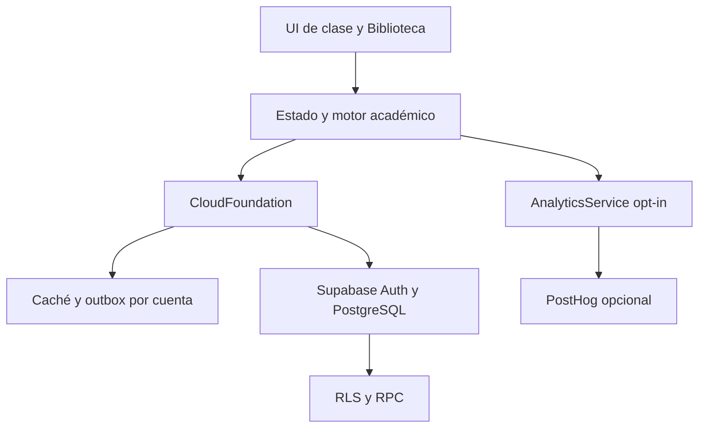

# Nexo Estudio — V14 · Academic Intelligence Foundation

V14 conserva aprendizaje, calendario, cuentas, tienda y avatar de V11–V13. Añade un piloto académico estructurado en **org-01 / Aminas**: conceptos, habilidades, prerequisitos, familias de problemas, intentos y evidencia, errores, estado de conocimiento, revisiones FSRS y una Biblioteca de referencias. No se rehacen las 45 clases ni se crean juegos, pagos o tutor generativo.

**Estado:** el modo invitado funciona sin servicios externos. Las migraciones y pruebas de seguridad corren en PostgreSQL embebido; el E2E entre dos sesiones usa una simulación HTTP. No se proporcionó URL/clave de Supabase ni PostHog: **no se ha validado un proyecto real**. Las cuentas, correo y sincronización física entre dispositivos requieren esa validación antes de publicar. El Site preexistente no se modificó.

## Instalar y ejecutar

Node.js 20+ y pnpm 11; el lockfile es `pnpm-lock.yaml`.

```sh
corepack pnpm install --frozen-lockfile
npm run build
npm run dev
npm test
npm run test:e2e
npm run test:perf
npm run test:all
```

Abre `http://127.0.0.1:8765`. Instala Chromium con `npx playwright install chromium` si no está disponible, o define `PLAYWRIGHT_EXECUTABLE_PATH`. `npm install` es posible, pero pnpm reproduce el lockfile. Sin Supabase, invitado conserva los datos en este dispositivo.

## Configuración cloud

1. Crea un proyecto Supabase, activa Auth por correo, confirmación y recuperación, y configura las URLs de redirección del dominio y `http://127.0.0.1:8765`.
2. Con Supabase CLI autenticada: `supabase link --project-ref TU_REFERENCIA`, `npm run supabase:prepare`, `supabase db push`. Las **ocho migraciones** canónicas de `migrations/` se copian a `supabase/migrations/` y se aplican en orden.
3. Copia `.env.example` a `.env`; configura únicamente `VITE_SUPABASE_URL` y `VITE_SUPABASE_ANON_KEY` (clave pública publishable/anon). `npm run build` genera `dist/config.js`. Jamás pongas `service_role`, `sb_secret_` ni secretos administrativos en el navegador.
4. Verifica en el proyecto real Auth, redirects, reset, A/B RLS, RPC, economía, inventario, calendario, conflictos, eliminación, sync y dos dispositivos antes de producción.

`VITE_POSTHOG_KEY` y `VITE_POSTHOG_HOST` son opcionales; analytics requiere consentimiento en Ajustes. `VITE_GOOGLE_OAUTH_ENABLED=true` solo después de habilitar proveedor y redirects. La Biblioteca funciona con metadatos y URL HTTPS; **Drive OAuth no está configurado** y el adaptador devuelve un estado explícito hasta contar con permisos mínimos y tokens seguros.

## Arquitectura



`dist/academic/` contiene modelo, grafo, diagnóstico, clasificación determinista, conocimiento, FSRS, fuentes, Biblioteca e historial. `dist/cloud/foundation.js` es la frontera de persistencia; ninguna vista académica consulta Supabase directamente. `dist/app.js` conserva orquestación y parte de la UI anterior; el nuevo motor vive fuera de él. El catálogo de org-01 sigue local y versionado; el progreso por cuenta se guarda en entidades privadas con RLS. `ACADEMIC_MODEL.md` describe contratos y flujo.

En Orgánica, abre **Mapa de conocimiento** (`#/knowledge`) para seleccionar nodos y ver su ficha; **Revisiones** (`#/reviews`) muestra vencidas y próximas. Biblioteca está en Ramos. El inspector de autoría se abre solamente con `?nexoDev=1#/inspector`. Su guía para agregar contenido está en `ACADEMIC_MODEL.md`.

## Integridad de datos

- V11→V12→V13→V14 mantiene migraciones explícitas. V14 pasa el esquema local 18→19, `migrationVersion=14`, conserva una copia exacta una sola vez en `nexo-study-beta-pre-v14` y nunca usa `localStorage.clear()`.
- Los IDs de intento/evidencia son estables e idempotentes. El estado de conocimiento deriva de evidencia; el mastery anterior permanece como compatibilidad a nivel de clase. La autoevaluación guiada de org-01 **no prueba corrección objetiva** de texto libre; se etiqueta como rúbrica personal y no acuña moneda.
- Delta sync usa cursor `(updated_at,id)` dentro de un watermark del servidor, con paginación; el watermark avanza solo al completar el pull. En la primera carga se trae el estado y una ventana reciente de sesiones/errores/intentos. Historial permite páginas de 30 y resumen de sesiones del servidor. La caché anterior y outbox siguen disponibles offline; conflictos conservan ambas versiones.
- La evidencia estructurada se sincroniza entre cuentas/dispositivos, pero el primer acceso aún debe leerla para reconstruir estado por concepto. Un agregado de conocimiento server-side sería el siguiente paso para historiales extremos; ver auditoría.
- Inventario y átomos siguen bajo RPC/ledger del servidor; importar JSON o declarar un evento académico nunca da moneda cloud. Rive actual carece de huesos/anclas de attachments: mantiene composición Canvas estable.

Consulta `V14_AUDIT.md`, `V14_CHANGELOG.md`, `ACADEMIC_MODEL.md`, `ASSET_MANIFEST.md` y `tests/README.md` para pruebas, privacidad, rendimiento y deuda pendiente.
