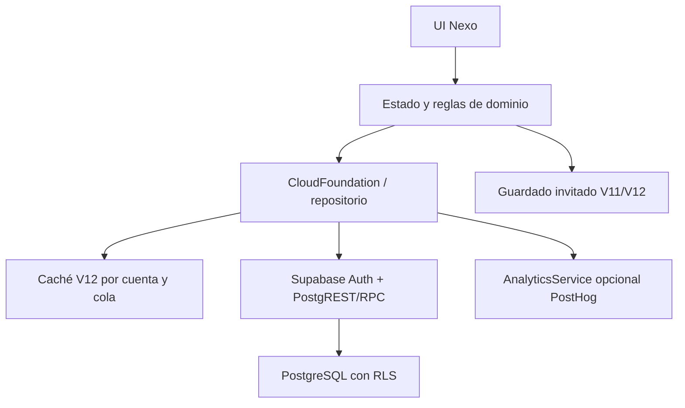

# Auditoría V12 — Cloud Foundation

## Estado y baseline

Se abrió el proyecto Sites existente (`nexo-estudio-nicolas`) desde el commit V11 `4684c1ea164faafa6c11d134828fd8933a957150`. Se leyeron README, V11_CHANGELOG y V11_AUDIT. Antes de modificar, `npm test` y `npm run test:perf` pasaron; las E2E de V11 no arrancaron inicialmente porque faltaba Edge y la descarga de Playwright falló. Se consiguió un binario Chromium 153 compatible por una vía independiente y después pasaron las E2E de V11 sin cambiar sus aserciones funcionales, excepto la versión de esquema esperada. Se creó el archivo íntegro `nexo-estudio-v11-restorable.zip` desde el commit anterior, SHA-256 `c18207c458985b5c775b4c6371dd96f19c4d6d4a9adee8c9853443ffe12a535d`.

**Límite de validación:** no se ha creado ni configurado un proyecto Supabase ni PostHog real para este Site. El servicio cloud se probó en navegador contra un protocolo simulado y las migraciones/RLS/funciones se ejecutaron sobre PostgreSQL 17 embebido. La confirmación por correo, OAuth, recuperación real por email y despliegue con el proveedor auténtico siguen sin prueba de extremo a extremo. No se declara V12 desplegada ni operativa entre dispositivos reales.

## Arquitectura

La UI usa métodos de `CloudFoundation`. Las consultas de tablas, Auth y RPC están reunidas en esa frontera. El catálogo académico sigue en archivos locales. `dist/config.js` contiene exclusivamente URL y clave pública, generadas desde variables de build, y un interruptor opcional de Google/PostHog. El SDK de Supabase se carga después del primer render; PostHog solo tras consentimiento.

## Autenticación y datos

Correo/contraseña: registro, inicio, salida, persistencia/recuperación automática de sesión, enlace de restablecimiento y cambio de contraseña. Google OAuth se habilita solo tras activar el proveedor y la variable de build. Los errores técnicos se traducen a mensajes breves. Una cuenta carga primero su caché local y luego los registros cloud. El invitado conserva `nexo-study-beta` y puede estudiar sin conexión cloud.

| Tabla | Clave y propósito | Escritura desde cliente |
| --- | --- | --- |
| `profiles` | `user_id`, nombre, zona horaria, archivo de economía V11 | Solo columnas de perfil permitidas. |
| `study_sessions` | `(user_id,session_id)`; duración y origen | Registro académico con control de versión; sesión premiada creada en RPC. |
| `lesson_progress` | `(user_id,lesson_id)` + versión de contenido | RPC con revisión; estado de dominio en columna y JSON detallado. |
| `exercise_progress` | `(user_id,exercise_id)` | RPC; borradores y resultado por ejercicio. |
| `academic_events` | `(user_id,event_id)` + fecha | RPC con revisión. |
| `grade_plans` | `(user_id,subject_id)` | RPC; componentes de teoría/laboratorio agrupados por ramo. |
| `error_records` | `(user_id,error_id)` | RPC; conserva texto privado en Supabase, nunca en analytics. |
| `user_documents` | `(user_id,kind,document_id)` | RPC; guías, exámenes, laboratorios, inasistencias, settings, personalización y estado transitorio. |
| `sync_metadata`, `sync_conflicts` | versión/migración y pares conflictivos | Columnas limitadas y políticas por usuario. |
| `cosmetics`, `user_inventory` | catálogo global e inventario por usuario | Catálogo de solo lectura; inventario solo por función protegida. |
| `currency_transactions` | ledger por motivo y referencia únicos | Solo funciones protegidas; saldo derivado. |
| `active_study_timers` | cronómetro por usuario, uno activo | Solo funciones protegidas con reloj del servidor. |

No hay una tabla gigante `user_data`. No se creó `user_settings` redundante: los ajustes son un documento tipado. No existe todavía registro histórico inmutable por cada respuesta abierta; `exercise_progress` conserva el estado actual y los intentos agregados. La transición de V14 podrá añadir `attempts`, conceptos, versiones y fuentes sin rehacer el esquema de usuario.

## Seguridad y economía

RLS está activada para cada tabla privada; las políticas `SELECT` se basan en `auth.uid() = user_id`. En PostgreSQL embebido se probaron dos identidades: B no leyó ni modificó registros de A; no pudo insertar inventario de A ni editar ledger, perfil económico o cronómetros. Catálogo de cosméticos solo lectura. Las funciones `SECURITY DEFINER` usan `search_path` vacío, referencias calificadas y validación de `auth.uid()`. Compras bloquean la fila de perfil, verifican precio y saldo, insertan el débito único y el inventario en una transacción: un error revierte todo. Se verificó una compra duplicada, saldo insuficiente sin débito, timer único y finalización repetida sin doble recompensa.

El saldo V11 era editable desde JavaScript: no existe una manera criptográficamente fiable de distinguir sus compras genuinas de un JSON modificado. V12 **no convierte** ese valor en saldo gastable ni crea inventario cloud arbitrario. Preserva el valor y los IDs antiguos en un archivo de perfil no canjeable y en las copias locales/exportables. Cuentas reciben 120 átomos iniciales e ítems iniciales del servidor. El cronómetro de cuenta puede conceder átomos solo con un timer iniciado y terminado en servidor. Si falla la red, guarda la sesión como manual sin premio automático. Recompensas de ejercicios/clases/desafíos y consumibles de V11 siguen en invitado pero están pausadas en cuentas hasta contar con reglas verificables de servidor. **Esta diferencia de economía es una limitación visible, no una migración monetaria completa.**

## Migración, sync, offline y conflictos

V11 local → V12 local esquema 17: se conserva literalmente el JSON antiguo en `nexo-study-beta-pre-v12` una sola vez; no se alteran los respaldos V11. Invitado → cuenta: copia sesiones, progresos, guías, notas, eventos, errores y ajustes por IDs estables; conserva la fuente local y registra `cloud_migration_completed` al completar la cola. La repetición usa IDs/clave única y no duplica sesiones. Si se refresca durante la migración, la intención y la cola quedan en el navegador para reintentar.

Para cada registro, la capa guarda la revisión remota esperada. Las funciones SQL hacen compare-and-swap atómico; una revisión distinta produce conflicto. El cliente conserva ambos valores localmente y en `sync_conflicts`, muestra un aviso discreto y permite exportar o elegir versión. En merge de dominio se mantiene el máximo de puntuación/intentos y nunca se degrada `dominado` a `inestable`. Sesiones de IDs distintos se unen. Calendar/notas ambiguos conservan el remoto y archivan el importado como conflicto. Moneda e inventario no participan en merge académico.

Los cambios se escriben primero en caché/cola local por usuario. `synced`, `pending`, `syncing`, `conflict`, `failed` están disponibles internamente. Al volver la conexión se reintenta con backoff hasta 60 segundos; se evita enviar dos veces la misma mutación con ID y revisión. La apertura inicial conserva contenido local disponible mientras sincroniza. No es una PWA sin conexión completa. Timestamps backend son UTC; el cronómetro usa tiempo del servidor y el día de estudio depende de la zona horaria del perfil. Fechas académicas se conservan como fechas civiles y solo se formatean en la UI.

**Riesgos restantes:** un dispositivo sin caché debe esperar su primera descarga; el historial grande aún se pagina en lotes de 250 durante la carga de cuenta, pero la vista de estadísticas V11 mantiene registros en memoria y puede necesitar virtualización. Los conflictos importados que el usuario aún no resuelve se exportan/archivan; la UI de resolución es básica. La cache en localStorage no está cifrada y puede ser leída por otra persona con acceso al mismo perfil de navegador. En datos académicos, el contenido de una respuesta sigue siendo información privada accesible en la base al titular de la cuenta; el usuario debe evaluar su política de retención antes de producción.

## Analytics y privacidad

Consentimiento desactivado inicialmente. Sin clave PostHog, bloqueo o fallo de red la aplicación funciona. Se desactivan autocaptura, pageviews automáticos y grabación. `track` acepta una lista cerrada de eventos (`app_opened`, clases, ejercicios, repasos, sesiones, calendario, tienda, cosméticos, errores de aplicación) y únicamente propiedades breves de IDs, resultados, intento y duración. No se pasan notas, respuestas completas, contenido de archivo, email, contraseñas o tokens. El SDK de PostHog puede añadir metadatos técnicos del navegador; se explica en Ajustes. Flags preparados: `learning_engine_v2`, `new_shop`, `new_avatar_renderer`. La UI no llama a `posthog.capture` directamente.

## Performance y pruebas

| Medición de archivos iniciales sin comprimir | V11 baseline | V12 |
| --- | ---: | ---: |
| Scripts iniciales | 15 | 17 |
| JS inicial | 341.182 B | 386.210 B |
| Hojas | 1 | 1 |
| CSS inicial | 77.476 B | 78.228 B |

El SDK de Supabase (~164 KB) se carga diferido al configurar la cuenta; PostHog (~174 KB) tras consentimiento. Estas cifras son tamaños de archivo, no métricas de red ni Core Web Vitals. La pantalla inicial aparece antes de sincronizar. Las pruebas de V11 y la auditoría de carga diferida pasan.

- `npm test`: catálogos V11, migración local, dominio Aminas, contenido Orgánica, merge/outbox/analytics, auditoría estática y migraciones SQL ejecutadas en PostgreSQL 17 embebido con RLS y dos usuarios: **pasan**.
- `npm run test:e2e` con Chromium 153: navegación/perfil V11 y V12 invitado → registro → segunda sesión de navegador → progreso recuperado; timer y recompensa persistente, compra y recarga, caída de red → guardado local → sync: **pasan**. El backend de este flujo es una simulación del protocolo Supabase; no reemplaza la prueba contra Supabase real.
- `npm run test:perf`: **pasa**.
- Búsqueda de `service_role`/`sb_secret_` en cliente generado, `localStorage.clear`, llamadas directas Supabase/PostHog desde UI, RLS y archivos de entorno: sin hallazgos de secretos ni acceso directo. La clave pública se valida en build.

## Próximos pasos y preparación

**Antes de publicar:** crear Supabase, aplicar las tres migraciones, configurar Auth/redirects, añadir solo valores públicos en build, ejecutar el recorrido en un backend real con cuentas A/B y confirmar email/password reset, compra, migración y eliminación. Configurar PostHog si se desea. V11 publicada permanece intacta hasta superar esa puerta.

**V13:** `cosmetics`, `user_inventory`, ledger y slots existentes permiten añadir tienda/avatar y nuevos cosméticos; cualquier pago requerirá validación adicional en servidor.

**V14:** IDs `lesson_id`/`exercise_id`, versión de contenido y progreso por entidad permiten añadir conceptos, prerequisitos, familias, intentos y revisiones. No se implementaron esas reglas pedagógicas.
