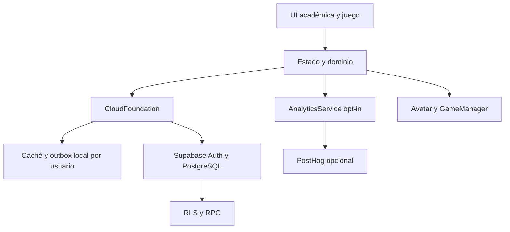

# Auditoría V13 — Avatar & Game Foundation

**Fecha:** 25 de septiembre de 2026. **Base:** copia restaurable `nexo-estudio-v12.zip` y V11 en historial. Antes de cambiar, se leyeron README y auditorías/changelogs V11/V12, se corrió la batería V12 y se verificó que pasaba. V13 no se publicó sobre el Site V11.

**Límite decisivo:** no hay URL/clave pública de proyecto Supabase real ni configuración PostHog proporcionadas. PostgreSQL/RLS/RPC se probaron con PGlite y contexto Auth simulado; el navegador usa una simulación HTTP de Supabase. Una validación en el proveedor real, correos/redirects, integración OAuth y dos dispositivos físicos permanecen pendientes. El código exportado no demuestra por sí solo operación cloud real.

## Arquitectura

`dist/app.js` sigue siendo orquestador grande (~2050 líneas). La tienda y editor se trasladaron a `dist/avatar/experience.js`; catálogo, composición, audio, animaciones y juegos son módulos independientes. Supabase/Auth/PostHog permanecen concentrados en `dist/cloud/foundation.js`; no hay consultas Supabase directas en componentes académicos. La separación completa de `app.js` sigue como deuda técnica, sin bloquear la arquitectura de datos.

## V12 hardening y sync

| Problema | Cambio V13 | Evidencia |
| --- | --- | --- |
| Pull recorría historial completo | Primer acceso limita sesiones/errores a 250 recientes; los siguientes usan `updated_at >= cursor` con watermark del servidor y páginas de 250. El cursor avanza solo tras aplicar el pull. | E2E inyecta 520 sesiones antiguas y comprueba una página delta. |
| Eventos borrados reaparecían o chocaban con fecha NOT NULL | `deleted_at` y tombstone JSON conservando `event_date`; RPC rechaza borrar sin versión existente. | SQL y A→B E2E: evento desaparece. |
| Desafíos cloud mostraban átomos que luego desaparecían | Recompensa cloud pausada e identificada como tal; invitado conserva recompensa local. | UI/guardia de handler. |
| Resolución de conflicto solo local | RPC restringida por `auth.uid()` registra `resolution`, `resolved_at` y `resolved_by`; la UI restaura conflicto local si falla. | SQL A/B y pruebas de repositorio. |
| Claim pendiente podía terminar en otra cuenta | Marker ligado a user ID o email normalizado; se rehúsa claim automático en cuenta distinta o OAuth sin destino verificable. | Tests de matching y E2E de migración/reinicio. |
| Analytics conservaba consentimiento tras logout | Se resetea identidad y se recalcula opt-out según preferencias locales. | Test de servicio y flujo de navegador. |

La caché y el shadow existentes no se borran durante la actualización. Historial anterior a los 250 recientes se obtiene mediante `loadHistory(table,offset,limit)`, pero no hay control UI para explorar todas las sesiones/errores antiguos: los datos siguen en servidor; paneles de estadísticas en un dispositivo nuevo reflejan la ventana cargada. Para un historial grande conviene materializar agregados server-side y una vista paginada. El límite de 200 páginas de delta ahora provoca error explícito, evitando avanzar cursor con datos truncados. Con escrituras concurrentes durante un pull paginado por offset cabe un caso de carrera; falta cursor estable `(updated_at,id)` y snapshot de servidor para escalas muy grandes. El cursor con solape evita la pérdida habitual entre pulls, pero no garantiza una transacción global de snapshot.

El servidor define timestamps/recompensas de estudio. El outbox aplica IDs estables y conflictos con CAS. Los estados `synced/pending/syncing/conflict/failed`, último sync/error y versión siguen disponibles; la UI usa señal discreta. Offline conserva estudio local y reintenta con backoff; no se promete una PWA completa.

## Migración y autenticación

Esquema local 17→18 con `migrationVersion=13`; guarda una sola vez el JSON exacto previo en `nexo-study-beta-pre-v13`, además de respaldos V11/V12. No usa `localStorage.clear()`. Exportación JSON se conserva. En cuenta, la importación académica no agrega moneda ni artículos verificados. Los saldos/inventarios anteriores del invitado quedan archivados y exportables, pero no se convierten en compras verificadas. Registro/login, persistencia, password reset y Google opcional siguen preparados como en V12, sujetos a configuración real del proveedor.

## Schema, RLS y economía

Cinco migraciones reproducibles: tres de V12 y dos de V13. Tablas: `profiles`, `study_sessions`, `lesson_progress`, `exercise_progress`, `academic_events`, `grade_plans`, `error_records`, `user_documents`, `sync_metadata`, `sync_conflicts`, `cosmetics`, `user_inventory`, `currency_transactions`, `active_study_timers`. Todas las tablas privadas tienen RLS con `auth.uid()`; `cosmetics` es catálogo público de lectura para autenticados. El esquema 13 añade campos del catálogo, trigger de posesión/compatibilidad de avatar e índices delta. Se comprueba A no lee/modifica B ni resuelve conflictos ajenos; cliente no inserta inventario ni transacciones, ni cambia campos de saldo. El trigger impide equipamiento falso vía tabla directa o RPC.

El ledger contiene transacciones con `(user_id,reason,reference_id)` único. `purchase_cosmetic` bloquea perfil, valida artículo/saldo, debita e inserta inventario en una transacción; doble intento no duplica compra. El cronómetro validado en servidor recompensa una sola vez por timer ID. Los desafíos académicos cloud aún no recompensan, a falta de validación de logros server-side. No se ha implementado pago ni separación definitiva de moneda ganada/comprada; si hay dinero real en el futuro, usar ledger/fuentes separadas y contabilidad revisada antes de vender créditos.

## Avatar, tienda y medios

Modelo: especie activa + siete ranuras (`head`, `face`, `shirt`, `back`, `tail`, `aura`, `background`) + estado de animación, apariencia y renderer. IDs antiguos se conservan. Catálogo con compatibilidad por especie, cinco rarezas, descripción, precio, asset key, estado y metadatos para ventanas/featured futuras. `preview()` no cambia el estado; `equip()` reemplaza una sola ranura. Tienda y editor admiten previsualizar, comprar, equipar, quitar, filtros, estados vacíos y varias capas a la vez. Los nombres de franquicias se sustituyeron por identidad propia y se retiraron recursos huérfanos confirmados; ver manifiesto.

Rive sigue animando las mascotas actuales; capas Canvas por delante/detrás representan los accesorios al mismo tiempo y comparten catálogo con fallback Canvas. **Límite visual:** las anclas son contrato de API, las capas todavía no están vinculadas a huesos en un rig Rive; movimientos amplios pueden desalinear piezas. Antes de nuevos avatares, crear rig con attachments o mejorar seguimiento de anclas. GSAP dispone de presets y respeta `prefers-reduced-motion`; Howler solo inicia tras gesto, ofrece efectos pequeños y control SFX, sin música. GameManager registra/carga/pausa/reanuda/destruye Phaser de forma diferida; escena técnica oculta, sin juegos nuevos. Un test confirma que Phaser no está en scripts iniciales.

## Analytics y privacidad

PostHog es opcional y opt-in. Servicio central con eventos allowlist y propiedades limitadas; no se incluyen textos de notas, respuestas abiertas, archivos, correo o tokens. Se deshabilita autocapture, grabación y pageviews automáticos. Logout hace reset/opt-out según invitado. Bloqueo o ausencia de SDK no rompe la app. Ajustes explica datos, sync y analytics. Eliminación de cuenta V12 usa RPC protegida y cascadas; validar en Supabase real antes de prometer eliminación operativa.

## Rendimiento y pruebas

| Archivos iniciales sin comprimir | V12 | V13 | Diferencia |
| --- | ---: | ---: | ---: |
| Scripts | 17 | 19 | +2 |
| JavaScript | 386.210 B | 394.849 B | +8.639 B |
| CSS | 78.228 B | 78.347 B | +119 B |

Se retiraron ~1,85 MB de skins/base obsoletos. SDK Supabase, PostHog, GSAP, Howler, Phaser, Rive y contenido pesado se solicitan según necesidad. Son tamaños estáticos, no métricas de velocidad de red ni Core Web Vitals. No se midió apertura en dispositivo físico.

`PLAYWRIGHT_EXECUTABLE_PATH=/tmp/nexo-chromium-153 npm run test:all`: **pasa** (unitarios/contenido, auditoría estática, PostgreSQL/RLS/RPC, navegación móvil, flujo invitado→cuenta→segunda sesión, offline temporal→sync, A→B evento borrado, delta con 520 sesiones y equipamiento multirranura/multidispositivo simulado, presupuesto inicial). `npm run supabase:prepare` genera las cinco migraciones CLI. Los E2E cloud usan mock; las pruebas SQL corren sobre PGlite, no sobre el despliegue del proveedor.

Auditoría de código: `service_role`/`sb_secret_` ausentes de cliente generado, sin `localStorage.clear`, sin acceso directo a Supabase desde vista, captura analítica cerrada, RLS en tablas privadas, promesas de sync con error/cola, callbacks y assets de escena limpiados. No se observaron nuevas regresiones críticas en la batería. El análisis estático y mock no garantizan ausencia de todos los errores de red, carreras o errores de producción.

## Trabajo pendiente antes de publicación

1. Crear/vincular proyecto Supabase y aplicar migraciones; configurar Auth y URLs. Validar con usuarios reales A/B, correo/password reset, RLS, RPC, conflictos, eliminación, catálogo e inventario en dos dispositivos reales.
2. Configurar PostHog opcional y verificar consentimiento/opt-out sobre el servicio real.
3. Añadir UI de historial antiguo/agregados y cursor compuesto para cargas/concurrencia muy altas; probar rendimiento de apertura en móvil real.
4. Vincular accesorios al rig Rive para animaciones amplias. Extraer más responsabilidades académicas de `dist/app.js` sin alterar el motor de aprendizaje.

V14 puede añadir IDs de conceptos, versiones de contenido, familias, fuentes, revisiones y validación de logros sobre las entidades/RPC existentes. No hay Learning Engine ni nuevas funciones pedagógicas en V13. La plataforma de juego está preparada para nuevos rigs, cosméticos y escenas, pero aún requiere validación real de cloud y seguimiento visual de attachments antes de congelarla para producción.
